# Symbologies

## **New Symbology**

**In this phase, 4 to 7 symbols without intersections may already appear (it is worth remembering that debts are formed when there is an intersection of these new symbols).**

**If intersections appear, it will be a debt generated now; in this case, we will identify the why and how to eliminate it, but this will depend on the person's change.**

### **Symbols**

**Emotional**

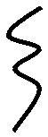

**Health**

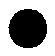

**Prosperity**

**Frequency adjusting, facilitating most things the person starts, opening doors and paths.**

**Almost everything done is in oscillation. If started in the positive, the results will be wonderful; otherwise, the loss could be great.**

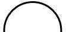

**Frequency of attraction of things or people. Ease in organizing, leading, giving direction to everything. One must not waste time.**

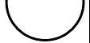

**Protective field very intense against feminine polarity (mental frequencies of envy, malice, etc.). Reasonable protection regarding the opposite polarity (there is some interference that can hinder).**
**There is a need to be attentive, alert to not suffer unnecessary risks.**

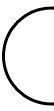

**Protective field very intense against masculine polarity (mental frequencies of envy, malice, etc.). Reasonable protection regarding the opposite polarity (there is some interference that can hinder).**
**There is a need to be attentive, alert to not suffer unnecessary risks.**

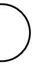

**Ease to win, open paths, overcome, and orient other people in the same frequency as yours.**

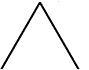

**Ease to aggregate, to add up in all senses. To indicate, to claim for oneself or others. Mediator frequency.**

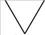

**Belo Horizonte/MG-BR, March 2012.**

## Symbology Manipulation

***Geometric shapes are mappings of different wave frequencies and each wave frequency outlines a shape (symbol), which is its vibrational language. Each shape has its frequency pattern language, has its frequency wave; therefore, each individual/dimensional has their wave frequency and no one has a wave frequency equal to another's.***

**The individual's wave frequency manifests in the third dimension through their shape/symbol, emitting a vibration or an energy frequency, which interacts with the energy field of their aura.**

**However, since the dimensional being has passed through various planets, their Initial Wave Frequency or their Pure Wave Frequency radiates diverse frequencies, which are associated with their symbology. Therefore, the individual/dimensional, already on Earth, when modifying their Symbology, it will only be altered in its energy, changing only its vibratory pattern, because their Matrix or their Initial Wave Frequency, which is their reflection in the universe, will always be the same.**

**The individual/dimensional is born with their symbology and it identifies them.**

**The individual/planetary does not have symbology, therefore, obviously, they cannot manipulate it. They cannot use the rules for this type of manipulation, because they were not born with their “plug” for the fourth dimension. The individual/planetary still needs to pass through various stages, various life stages, until reaching the level of the mental/vibrational frequency of the dimensional.**

**The dimensional who has already learned how they must view their Symbology on their mental screen – now also needs to learn to manipulate and modify it, through their thought, their desire, and their will.**

**By modifying their symbology, the dimensional is using their free will, to also modify their destiny. Everything is a question of conditioning, change, and coding. When the dimensional exercises their free will, they can change their vibratory pattern, can change their mental pattern, and with this, can change everything in them and around them.**

**The changes that happen in the dimensional's life, when they modify their Symbology, must show themselves within the reality of the third dimension, to be considered true changes.**

**When the dimensional alters their symbology, placing a straight line or a point in it to modify their emotional state, for example, they will only be worked on energetically at that point, bringing them no harm if they make this alteration poorly. They will only have to repeat it.**

**In Symbology, curves represent debts. Points, circles, and straight lines represent credits. And, depending on the size and shape of the curve, it represents material, emotional, physical, or sexual debts.**

**Small elongated curve**:
 
 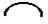
 
 Physical Debt – means the individual has already committed some act against someone's physical body or against their own body.

**Closed Curve:**
 
 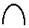 

 Material Debt – means the dimensional harmed someone in financial/material terms.

**Open Curve:**
 
 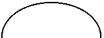
 
 Emotional Debt – means the individual/dimensional interfered greatly in someone's emotional state or was emotionally very disturbed. Usually, this individual is lonely, without friends.

**Small closed curve (like a little tail):**
 
 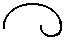
 
 Sexual Debt – the individual made incorrect use of sex, utilizing their sexual activity in circumstances and situations not compatible with Universal Laws.

**To perform the manipulation of their Symbology, cleaning it, it is necessary that the dimensional has already taken it from their frontal [chakra area] and has already identified the curves in it.**

**The dimensional needs to know what they want to improve in their life. After this, they must locate in their symbology the curve that represents this issue that afflicts them, concentrate, and, through a projection on their mental screen, already knowing what they want to alter, must mentally redraw their Symbology, stretching a curve or placing a point, which they previously defined as necessary, so that the desired change happens in their life. That is, the dimensional will transform the curve of their Symbology on their mental screen into a straight line or place a point on it, so that their vibratory frequency begins to vibrate positively, tuned to what they want. The individual/dimensional will remain concentrated, mentalizing for one minute, without the need to accelerate or activate themselves or any other special preparation. They should only remain in concentration.**

**As the drawings below show and as previously mentioned, the dimensional can stretch their symbology and add a point or a dash to it, with the intention of modifying what they want, removing from their life what unbalances them. This example also applies to symbologies that do not possess curves.**

Before

After-1

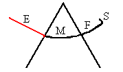

After-2

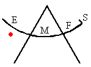

**The dimensional who only has credits, has certainly already burned their karma, passed through various problems and disappointments. They have already suffered, but certainly have already paid with their learning what they owed in other lives or even in this one. And, if they have already burned their karma, they are ready to start the final work of their cosmic commitment.**

**Even if the individual has an excess of credits, they need to alter their symbology, if they are having some personal difficulty, because any excess is bad and, therefore, needs to be manipulated for balance.**

**It is recommended that the dimensional does a reinforcement, with the same alteration, every three months, three times in a row, after the first manipulation of their symbology. Therefore, the reinforcement is done over nine months, because the tendency of the symbology is to return to what it was before. After this time, modifying it at the same point, the modification totally reverses the individual's conflict situation.**

**The second time the dimensional goes to alter their symbology, the desired alteration should already appear on their mental screen, otherwise, the alteration did not work, because their symbology returned to its original form. Therefore, the individual must mentally repeat it.**

**The mental screen obeys the thought, the desire, and the will of the individual/dimensional.**

**To facilitate this energetic/vibrational modification the dimensional must learn to hold their breath, because by holding it all their channels (twenty-seven in women and eight in men) vibrate equally. Normally each channel vibrates at a different rhythm.**

**When the dimensional holds their breath, they accumulate the maximum energy, forcing all their brain channels to work uniformly, with the wave of their thought in a single rhythm (frequency) going toward a single objective, toward a single energetic direction.**

**The individual who has difficulty concentrating and visualizing their symbology, must learn to do this exercise with their breath held.**

**The dimensional in their human condition will never be free of the “astral plane”, because they are a three-dimensional/emotional creature. Therefore, as the individual who naturally already has this side of identification well developed with the third dimension, they must now learn to develop their mental side, to work on their daily difficulties and transcend them.**

**The dimensional is the one who gives the mental order to modify their symbology with a point or stretching it with a dash. It is they who emit a coded vibration to their subconscious, through their will and desire for this to happen.**

**Any paranormal and active faculty of the individual is linked to the manipulation of their mental/vibrational energy. When they develop this extraordinary mental capacity, they will never have depression and if they ever had it one day, it will never return.**

**When the dimensional is manipulating the symbology of other individuals, they will really be exercising their condition of a demi-god and this will be the next stage of their learning, which will demand from them an attitude of extreme responsibility, when they make the alteration of the curve in the individual's symbology, altering it, at their request.**

**The interaction between human beings for this energetic alteration is much easier to be done, than on an object.**

**All dimensionals who have already done the first phase of plasma, already have the conditions to modify their symbology, which they could not do before, because they did not have the necessary energetic vibration.**

**The dimensional who has difficulties visualizing their wave frequency, obviously, will have difficulty seeing their symbology on their mental screen and in this case, it is interesting for them to verify if their meridians are blocked.**

**In the human body, cuts made in surgical acts (including liposuction), cut the individual's meridians, which need to be reconnected energetically. But, there are cuts impossible to be reconnected due to the locations where they were made, which definitively hinders the dimensional from visualizing their wave frequency, due to their energetic deficiency in these points of their damaged body. The ultras will help the dimensional, who for this reason, has difficulty visualizing their wave frequency.**

**When the dimensional in their passage through a planet, does not have any cut in their symbology, even if it is a curve, it represents not a debt but a credit.**

**The dimensional must observe whether the curves in their symbology are cut by dashes or not, so they can consider them debts or not.**

**credit**

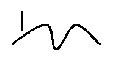

**debt**

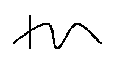

**The woman (negative polarity) is born with a polarity intensity of at least 27 cycles per second, which she can accelerate or decelerate during her life.**

**The man (positive polarity) is born with only eight cycles per second. Therefore, with only eight cycles per second, it is easier for him to manipulate them.**

**The woman has much more mental capacity than the man, especially now that humanity is entering the Age of Aquarius. At seven years old she is already developing at least some item of alchemy/transmutation.**

**The woman has much more electric charge, much more energy, that is why she manages to transmute, do alchemy, materialize, and propagate better. The woman can transcend faster than the man, because she is much more evolved and has much more mental/vibrational capacity. She just needs to learn to manage her emotional state, so she can utilize this immense vibrational capacity.**

**For the dimensional to identify the debts and credits of other individuals it suffices that they observe in their symbologies, if there are also straight lines, points, circles, or curves in them.**

**As already mentioned:**

**a) Straight line regardless of its inclination, the point and the circle represent credit, meaning the individual performed good actions in previous stages, no matter what they did or for whom they did it.**

**b) Curve represents debt, which the dimensional has the commitment to redeem from other individuals or some races or even, from someone in past lives. For this reason, many times, they suffer losses without apparent reason and do not understand why they happen. In many cases they also suffer blocks, have sentimental difficulties and complications in their physical health. However, genetic debt is the worst. Genetic karma is when in the individual's symbology, a point appears touching a dash or in the middle of the dash, bringing them alteration in the vibrational field of their aura and this reflects in their physique, possibly reaching some physical deformation.**

**genetic karma:**

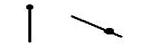

**c) Repetition of passages through the same planet (crossing of straight lines and curves):**
**up to 6 passages – no debts;**
**from 7 to 14 passages – sexual debt;**
**from 15 to 21 passages – neutral phase;**
**from 22 onwards – the dimensional has already paid all debts. They were a leader in other lives and, therefore, currently they can represent multitudes, can give information and lectures, preparing individuals, etc.**

**Debts reflect on everything, so it is better for the individual to get rid of them as soon as possible.**

**In their symbology the dimensional must identify the graphic symbols of the races, where their debts are located. In this way they can know them and redeem them, doing something “positive” for the dimensionals of the races, which were signaled to them as creditors.**

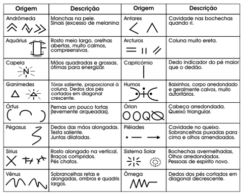

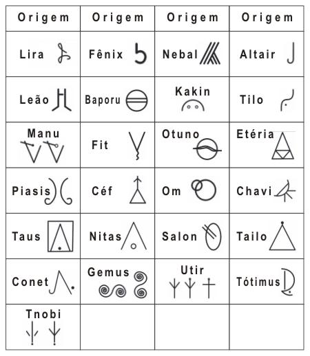

**With the payment of their debt the individual/dimensional will be able to remove the graphic curves from their symbology, possibly even cleaning it.**

**The excess of credits must be passed on through works with donation of energy and propagation of the messages of the “beings” making individuals aware, among other works, so that the dimensional does not stay with excess energy, which accelerates their laryngeal and frontal chakras, causing them anxiety, compulsion, mental confusion, and other difficulties in their day-to-day experiences.**

**The dimensional who has already learned to identify in their symbology the various types of debts, now, it remains for them, to learn how to pay them:**

**If the debt is material, the dimensional must help the individual/creditor materially, helping from the heart someone in need from the race with which they were in debt.**

**If the debt is physical, the dimensional must find someone who has the same physical deficiency as theirs and then, help them from the heart.**

**If the debt is emotional, the dimensional can redeem it through a work where they donate energy or through a conversation where they harmonize the individual or even, through other forms of redemption for this case.**

**Thinking alone does not help, the individual must think and act harmoniously, redeeming their debts always with good will, otherwise, instead of paying them off, they will be increased. Therefore the redemption of their debt must be done for the individuals/creditors with whom the dimensional has energetic compatibility (affinity), otherwise they will not redeem them.**

**1) Upon paying their debt, donating credit to themselves, the dimensional can redeem it directly from the individual/creditor. If their debt is from past lives, the dimensional can make their redemption for any individual of the same planet or the same race.**

**2) The debt of this incarnation must be redeemed for the individual themselves for whom the dimensional has debt, but can also be paid to those who have a direct or indirect connection with them. In this indirect form of redemption, the dimensional can pay off a large part of their debt and, leave to redeem the rest of it until 2014, when the symbology will disappear from their frontal and when this vibrational coding of theirs will no longer be necessary. In this vibrational cleaning, if the dimensional with the end of their mission on this planet, does not make the total redemption of their debts, they will keep the curves in their original symbology, as marks of debts to still be redeemed later. Even if the dimensional is already without debt on Earth, they will continue with debt with the Cosmos, with the Universe, redeeming it totally, only after the end of their cosmic commitment.**

**3) Due to the difficulty in the redemption of the debt, related to the identification of whom the dimensional must pay or even in what way they must pay, the “beings” allowed them to transform their debt and credit into commitment. For this the dimensional must do the following:**

**For the man – He must transform the larger curve of his symbology into a straight line.**

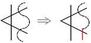

**If there are no curves, he must double the size of the largest straight line.**

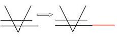

**For the woman – She must add a point on the largest dash that exists in her symbology, whether it is straight or sinuous. Likewise, if they are parallel and equal straight lines, she must place the point on the bottom line.**

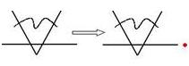

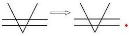

**Opportunities for payment will arise, as there is a universal programming regarding situations so that they happen, making the dimensional feel and intuit whom they must pay or towards whom they must redeem themselves.**

**If in the individual's symbology debt and credit appear in equal proportions (symmetrically), they can cancel each other out and with this, also cancel their symbology and so that another one is created for them, they must submit themselves to a special/specific vibrational work, which will make them interact with the fourth dimension.**

**Generally the symbology (symbol) of the woman has the red color and that of the man has the silver color.**

**Plasma is physical and not energetic, therefore, it is no use for the individual to modify their symbology so that it increases. Working their electromagnetic field (kundalini) is how they consequently increase their energetic capacity.**

**The dimensional/Project Portal's past lives debt has already been zeroed, the debt in their symbology that is being worked on today, is their debt of their current life.**

**Repentance of errors can soften the debts, but, will not pay them.**

**The individual/dimensional must work to reach another evolutionary pattern, to exit the dimensional pattern and enter the angelical pattern.**

**The dimensional who is already manipulating Vibrational Frequencies radiated from other more Subtle Levels of Manifestation, must never forget, that they will really be a demi-god on Earth, if in their day-to-day their thinking and acting are in tune with the (Neutral) Energy of the One Love and that, therefore, the manipulation of their symbology is, above all, an instrument, so that they can radiate more quickly to themselves, to their fellows, and to the Universe the Transcendent Light of this Love.**

**Lagoa Santa/MG-BR, October 13, 2004.**

## Interpretation of Plates

**Text provided by Project Portal**

**The dimensional must evaluate the Symbols in various ways:**
**– Individually;**
**– Grouping the Symbols, “forming phrases”;**
**– Observing both sides of the Plate.**

**The Plates when they are accessed and possess no code, but, which gradually form as if they were written by laser, are from individuals/dimensionals who may be invited to participate in Transmutation and Alchemy experiences. They will have improvised works and in conjunction with Extraterrestrial Beings.**

**The dimensionals who at the moment of accessing their Plate manage the materialization of different objects and only after other attempts materialize their Plate, possess special abilities, but, at the moment are in inner conflict – they lack something, for example, affection, direction, calm, guidance, neediness, anxiety control, etc. Therefore, their abilities are being blocked or misdirected.**

**The Plates that have no Symbols are from individuals who will give protection in secret works and in subterranean locations indicated by Intraterrestrial Beings or Extraterrestrial Beings. And, they also possess mental abilities easy to be awakened. But, their training will start the moment the pyramid in the Zigurats Tourist Complex is under construction and already nine meters above ground level.**

**The dimensionals who plasm two or more Plates have works with Intraterrestrial Beings (in the galleries/cave) and can also help in the reception of Beings of Light in the near future.**

**Plates with texture similar to ceramic (tile, brick, etc.) are from individuals/dimensionals who will have knowledge of all intraterrestrial bases not only on this planet but also on other planets.**

**Plates with their texture similar to a wafer are from dimensionals who possess an enormous mental influence, but, need training and activation with the extras.**

**Plates with their consistency similar to slate stone are from individuals/dimensionals with superior characteristics and abilities, but, their awakening is still at the beginning, therefore, they may pass through a process of doubts, conflicts, insecurities, fear, etc. And, they will only exit this phase seven months after accessing their Plate.**

**Plates with their texture not very consistent like foam (of a sponge) are from individuals endowed with extrasensory abilities. They just need to stabilize the energy in their frontal.**

**The dimensionals who manage to dematerialize their own Plate possess abilities to centralize vibrational energy in their frontal. And, the training with this objective can only begin after seven months of accessing their Plates.**

**The interpretation of the codes of the Plates of the group that will work with the Inner Worlds was one hundred percent. And, when one of these dimensionals had a doubt, they noted it and handed it to the coordinators, who passed it to the Mediator, who subsequently resolved it.**

**Some individuals after the access of their Plates can be invited for contacts with the Beings to be activated, so that they can adapt to their new vibration.**

**The Plates of the dimensionals that have no Symbols on either of their two sides, they can have contacts with Extraterrestrial Beings and the Intraterrestrial Betamix.**

**The Plates with Symbols only on one of their two sides are from dimensionals who can have contacts with Extraterrestrial Beings and the Intraterrestrial Thoth.**

**The Plates with Symbols on both sides are from dimensionals who can have contacts with Extraterrestrial Beings and the Intraterrestrial Laquim.**

**The individual/dimensional only receives their Plate directly from the Beings, if it is delivered inside the Cave of Bats (Batcaverna). And, in it each individual or group of individuals possesses their propitious vibratory day, so that they can access their dimensional “entry”.**

**Some Universal Codes/Symbols:**

| |  |  |
| :--- | :--- | :--- |
| 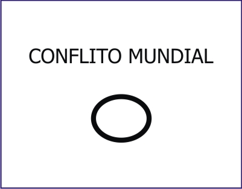 | 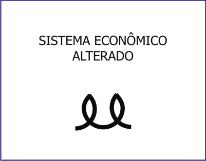 | 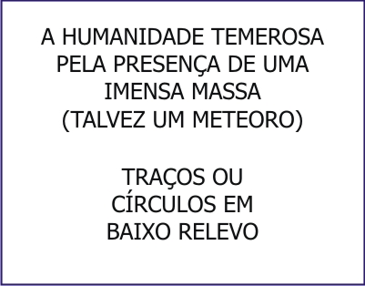 |
| 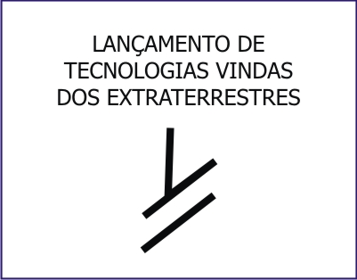 | 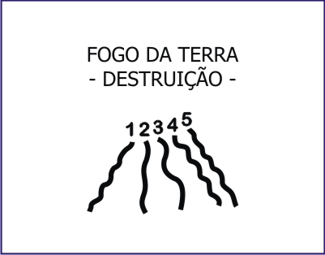 | 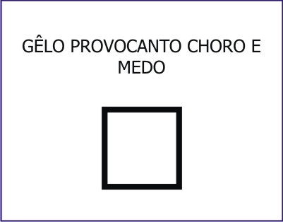 |
|  |  |  |
| 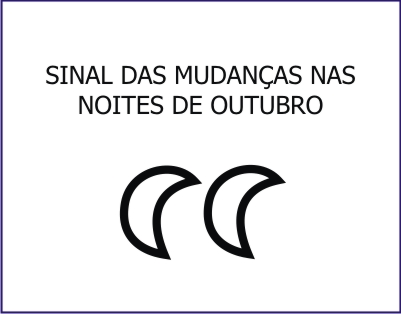 | 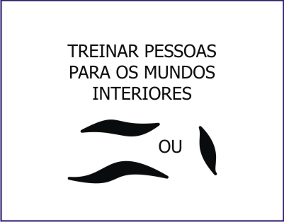 | 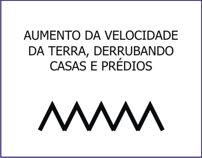 |
| 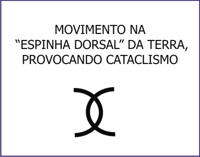 | 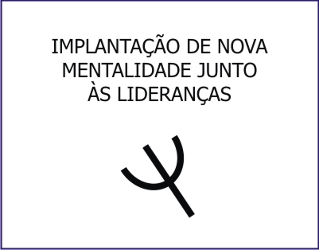 | 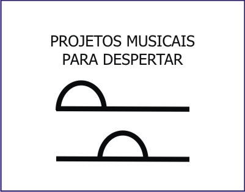 |
| 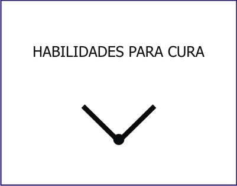 | 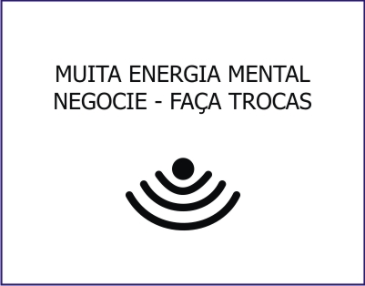 | 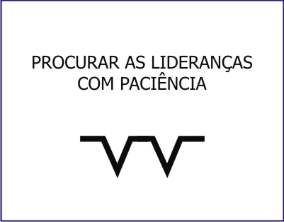 |
| 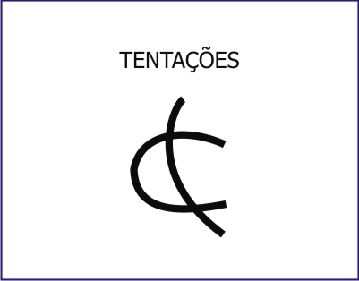 |  | 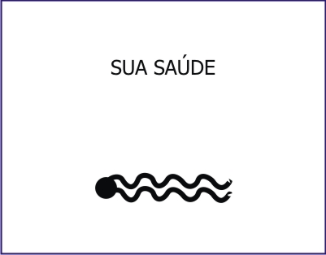 |
| 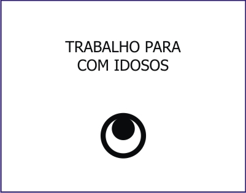 | 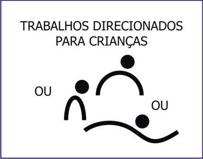 | 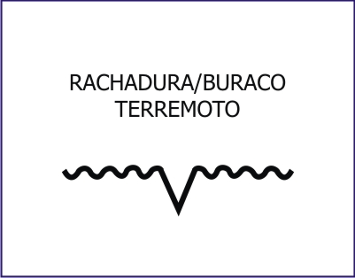 |
| 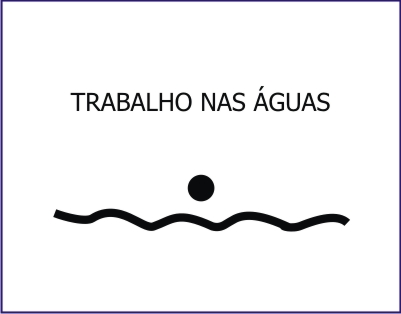 | 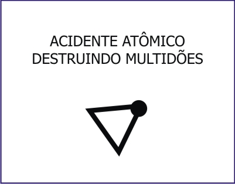 | 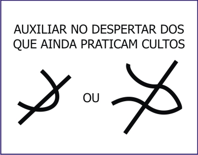 |
| 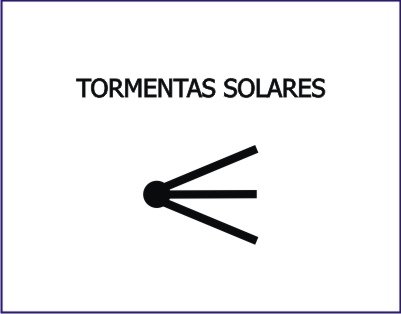 | 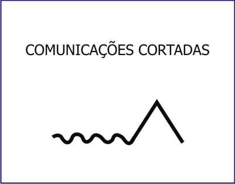 | 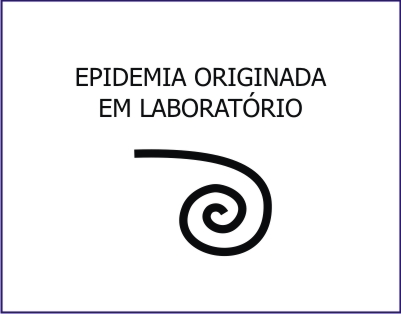 |
| 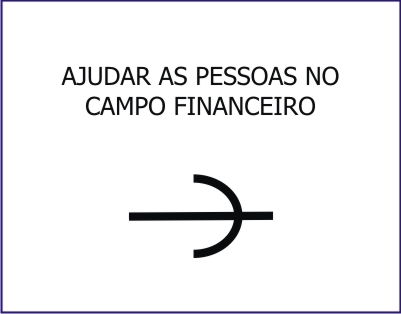 |  |  |
|  |  |  |
|  |  |  |
|  |  |  |
|  |  |  |
|  |  |  |

## **The Extraterrestrial Alphabet**

**– Text provided by Project Portal –**

**The extraterrestrial beings passed to the dimensionals/Project Portal an alphabet, since many things left by them are written (coded) in this way.**

**Writing:**

**The brain has two halves, which are virtually mirror images of each other, but, with different functions.**

**The left side of the brain controls the function of speech, logic, and reason – it is the scientific part of each human being. And, the right side of your brain recognizes shapes, patterns, and sounds – it is the “artistic part” of each human being, which appears in moments of their sensitivity/inspiration.**

**Thoughts are extremely short-duration electromagnetic events that happen in the human neurological system.**

**Every image affects the brain, producing changes in the nervous system and in its chemistry, influencing the individual in the way they express their emotions. And, in it emotions still directly affect their muscular system, hormonal and also their physical state, their decisions, their actions, their thoughts, and their behavior.**

**The language that uses metaphorical images to guide a stream of thought is called ideographic. They are very simple and abstract illustrations that allow transmitting instantaneously many things at once, being captured by the right side of the brain, transmitting a common meaning together with all ideas connected to it. Therefore, transmitting in an idealized way everything the object signifies, as if its symbolic image taught what it represents, what it is for, who made it and how one should use it. And, this form of communication by images and not by words is the basis of telepathy (faculty of the right side of the brain).**

**The word which is a collection of letters and syllables captured by the left side of the brain and based on human language instead of drawings of objects, expresses a single frozen concept – for a “narrower” form of consciousness.**

**The writing of syllables which is supposed to have been one of the most important advances in the history of man and which appeared when he abandoned a system based on the right side of his brain, actually represented the loss of his communication through images, in an event that delayed his development of consciousness – by creating for him a true Tower of Babel.**

**However, it is the way of expression/communication based on the right side of the brain, combined with the current rational way, based on the left side of the brain, that will lead man to a new place: the simultaneous use of his two brain hemispheres, accelerating the development of his consciousness – and, that was the case of the Mayans. This new language will lead man to a simultaneous state of reason and intuition (solar and lunar; masculine and feminine).**

**A civilization that communicates in this way manages more easily to reach levels of accelerated mental frequencies, producing a more integrated view of Reality (of all realities).**

**Below the Extraterrestrial Alphabet with its 27 symbols (number of the direct energy of Transmutation and Alchemy), which have a much greater and much more important meaning than just substituting letters for symbols. Also below the numbering in Irdin from zero to nine.**

**Each letter of the extraterrestrial alphabet characterizes a hill or mountain, modeled by the Beings and spread through various locations of the planet. This location is the signaler of the Beings for when they return to Earth. And, each one of these letters or symbols possesses a range of information, which was gradually being passed by them to the dimensionals:**
**• Letter A: characterizes a plateau in Mexico;**
**• Letter D: is the Symbol of Healing, of the Vibrational Energy of Cosmic Tuning, of the Universal Energy, of the Direct Tuning with the Cosmos;**
**• Letter E: is at a point in Rondônia (2nd location of the plates);**
**• Letter F: characterizes a hill in Mato Grosso;**
**• Letter I: means Son;**
**• Letter J: is at a point of the mountains that surround Belo Horizonte and Mato Grosso.**
**• Letter P: means Light;**
**• Letter R: is also at a point in Rondônia (2nd location of the plates). The dimensional who is related to it is in some way a descendant of the Atlanteans, having a special and specific work linked to it at the right time;**
**• Letter U: characterizes a hill in Egypt;**
**• Letter Y: is still at a point in Rondônia (2nd location of the plates);**
**• Letters RR: are from dimensionals who possess a double mission, possess a different vibrational coding. They are also in some way descendants of the Atlanteans, and will have a special and specific work linked to them at the right time.**

**The opening of the portals is also in resonance with certain symbols, which have the exact vibration for this, like the letter “R” – with its spiral shape.**

**NOTE: The city of Atlantis was also designed as a succession of circular rings of land and water, communicated by bridges, to then flow into the Atlantic Ocean. In its central ring was a great Pyramid. Each ring with 30 km in diameter. It was known as the Circular City of Poseidon.**

**The work with the Letters of the Alphabet was a work started in 1999, but, due to the large number of other works that had to be done before, because they changed their vibratory way of performing them by orientation of the Beings, the work with the letters was concluded only some time later.**

**And, a whole prior decoding was necessary so that the dimensional/Project Portal could access their cosmic memory, facilitate “their fusion of consciousness” and could “discover themselves in more detail” in relation to their SELF.**

**In this work the dimensional Project Portal had to look for their letter(s) and this search was preceded by a number provided by the Mediator, who indicated the location of the same in the “Hill of Archives” (Morro dos Arquivos) at Fazenda Boa Sorte, municipality of Corguinho/MS-BR. Therefore, this numerical signaling dealt with identifying in various points of that hill, where the letters of the dimensional's extraterrestrial alphabet were engraved in bas-relief.**

**On that occasion the dimensional who received an Even number, they had to look for their mark(s) in the region between the Plateau and the Marks and that other dimensional who received an Odd number, they had to look for it/them between the Marks and the Craters.**

**The dimensional in this work when they found one of their marks – which also make up the extraterrestrial alphabet – they had to position themselves on top of it, when they could through flashes of their past feel a strong emotion associated with their mission – as if at that moment they were doing “a conscious regression”. This intense feeling of theirs motivated by this “regression” was due to their great emotion of having returned to the place where everything started for them 6,004 years ago and, also, by their proximity to their plate – besides other situations in which they decoded them when this work subsequently continued.**

**And, that individual/dimensional who felt nothing in the presence of their letter/symbol, they had to go around it seven times, in the attempt to awaken their intuition/perception.**

**The letters that mark these locations still identify vibrationally the forty-nine races.**

**The individuals/dimensionals who possess the same letter(s)/mark(s), had a certain mission together a long time ago, but, each one will currently perform their mission according to the codings of their plate.**

## Descendancy

**Descendancy has the sense of showing that a person (dimensional) descends from someone – indicates their lineage. There are diverse lineages, such as for example, of Abraham, Moses, Isaac, Lilith, Magdalene, etc. Each person belongs to one of these lineages already identified through the photo aura, activations, and readings. However, the work with these lineages will be performed further ahead and it is linked to each person's abilities.**

**When the person possesses a large dash in their Descendancy, it indicates that they “see everything from above”, that they have a broader perception. They see everything differently, therefore they are no longer stuck to the 3rd dimension and have already developed abilities associated with their condition of dimensional with their conscious-creator power.**

**They can already manipulate these abilities with ease even while oscillating. Oscillation that shows itself through the circle that involves the asterisk and that keeps changing position, but even in this situation the person already feels the need to stabilize – to vibrate in Line B consciously or unconsciously.**

**They can anticipate things from their future, going from line B to Line C, which through this frequency will bring whatever good is desired, having the “view from above” or the broad perception of things. These are abilities or facilities that they have.**

**The larger the dash/trace in a person's Descendancy, the greater will be the intensity of their development in a general way, allowing them to manipulate well one or all three Frequencies/Lines of Life (three asterisks). Thus, being large or small, the dash indicates that they are developing their perceptions – are acquiring the power to manipulate their abilities.**

**Interpretation**

**If the person has only one asterisk, it indicates that their evolution is a bit slow.**

**If the person has two asterisks, it indicates that they are doing very well regarding abilities. It means that they already have active abilities, which can be used or not. They have already activated two frequencies, two active mental qualities, thus being able to generate multivibrational frequencies.**

**The Descendancy also shows a pattern that is linked to the manipulation of the Lines of Life. And if the person has three asterisks, it indicates that the three frequencies of the Lines of Life are already active. Each asterisk represents one of the Lines of Life, an ability – it is associated with the ABC Lines frequencies of the Lines of Life (Thought, Desire, and Will).**

**Each ability that the person (dimensional) already manipulates, is shown through a circle around the asterisk:**

**If in a person's Descendancy a circle comes around a certain asterisk, it indicates that they already develop and dominate reasonably well the energy relative to it. But, these circles can alter, appearing on other asterisks and even disappearing from them. When this occurs, it indicates that the person is oscillating and that is not good. It indicates that at one time they are on Line A, another time on Line B or on C. If the person is on a Line, they must initially remain on it, but must go adding the circles on the other asterisks. They have to evolve, developing the energies (laws) inherent to the asterisks already circled, to then be able to manipulate them.**

**Having two circles in Descendancy, indicates that the person already has the multivibrational frequency. Indicates that they can already mold, “manufacture” their destiny, be their own “god”. This person already presents more mental capacity in the sense of achievements in all senses and can stay much longer in conversation with the beings. And it also means that they will produce the 3rd circle quickly.**

**When the person in their Descendancy has the circle on the three asterisks, it indicates that they already have the frequency of demi-god (of active divinity) and that they never again lose those circles, because they can already totally manipulate the laws inherent to these three frequencies. However, that person who has the circle only on one or two asterisks, the tendency is for now to oscillate. Thus, they have to strive as much as they can, to maintain the circle they already have and go adding it to the other asterisks that are missing, so that they can put a final point in the conclusion of their Descendancy – so that they can completely manipulate their abilities. They will only perform teleportation, materializations, see aura, etc., with the three asterisks circled. Until March 27, 2010, all persons (dimensionals) need to be in this condition.**

**Today there is no way for the person to stay “parked”. They can no longer stagnate in a certain stage, even if they no longer frequent the physical Project Portal, because they no longer have a way to stop their thoughts regarding the way they now view the world, view life. Automatically they will pass through stages – through each one of them in due time. However, this occurs only in the dimensional person, who manages to work the Lines of Life.**

**Thus, the 1st asterisk appearing, the person (dimensional) will proceed whether they want to or not, as their evolutionary-vibrational process does not stop anymore.**

**Line A**

**The asterisk with circle in Line A signals the life the person has. In the situation where the first asterisk is circled, it indicates that the person can already block at least 80% of the negative that possibly could happen to them.**

**In this condition (Line A) the two aspects (positive and negative) exist, when the person can annul both the negative and the positive. If they get very depressed, they can still manipulate and exit this situation, but it indicates that negative aspects still continue happening in their life, for not taking the maximum advantage possible of this frequency. It means that they are not managing to polarize their emotional frequencies, which to manipulate them, they must desire in Line A and generate the Will in Line B, so that what they want happens to them in a satisfactory way.**

**If the circle is not present on the asterisk relative to Line A, it means that the person does not totally dominate this frequency and that situations may or may not happen in their life – and thus, what they would not like in their life.**

**Line B**

**The circled asterisk in Line B shows the life the person lives. This condition indicates that they can already achieve everything that is wanted in the 3rd dimension. It is the balance of the mental/astral, spiritual/material and of the positive/negative. Being in this Line which is the middle one, the person manages to work well the positive and the negative. Manages to work on what they want and on what they do not want for themselves or for others. In this Line, it enables them to concretize, delay, anticipate or annul any event that is in their future – they have the possibility to generate that vibration.**

**Line B is the Line of Neutrality and in it the person manages to work the other two Lines. The ideal would be that the person (dimensional) had the circle at least in line B, because in this way they would manage to manipulate paranormal phenomena (mediumship, perception, intuition, mediumistic interaction with spiritual entities or not, etc.).**

**In this Line the balance of the mental and the astral happens – where the rational and the spiritual plane walk in parallel. It is where one also manages to have a very good dosage of the laws of the 3rd dimension.**

**But, when only line B is in development (with the asterisk circled in this Line), the “ego” can go sky-high, therefore the person has to be very careful with this.**

**Line C**

**The asterisk circling Line C signals the life the person wants – the one they desire to have. Thus, in this situation it indicates that the person already achieves the realization of their dreams, because they already project their future and concretize it.**

**Codes**

**Besides the asterisks in Descendancy, some codes may come together, which can be letters, circle, square, dash, spiral or other symbols**

**These codes can vary a lot, as they are linked to the person's emotional pattern, which changes every second. They are daily oscillations of their emotional frequencies, indicating that some of them hinder them.**

**There are more than 200 different codes, but the person will only have the interpretation of such codes, if they have only one asterisk. In this case it will be interesting that the person verifies the meaning of these codes, because they may also show them the why of their delay to generate the circles around the asterisks – they will need to verify through these codes what is hindering their life.**

**However, even if the person already has the circles involving the three asterisks and if even so these frequencies still continue interfering in their life, they will have to verify them, work them, so they can remove them. In this situation the person even manages to prosper, but always has a parallel pending issue that bothers them at the level of their subconscious (keeps tormenting them and taking away the satisfaction of their success). After March 27, 2010, if the person still has these oscillations, they will be worked on in this sense.**

**Examples:**

**If in a person's Descendancy the dash exists horizontally, it is signaling to them the state of happiness, harmony, and relationship.**

**Now, if in a person's Descendancy the code appears in the form of a little ball, it signals to them an emotional frequency linked to anxiety and compulsion, also representing a pattern/frequency of active divinity. The person who has this little ball, in December/2009 will have much more ease to work on the Road of the New World. For this work they already possess the necessary frequency for conversation with the two divinities Lilith and Emanuel – what most people are still seeking, (developing this ability). Therefore this person (dimensional) who was already born with this ability, they do not need to do any preparation in this sense – they for some reason are already prepared for this ability since they were born and will still have much more ease of conversation with the beings in a general way. Who has already received the frequency of divinity already finds themselves in this condition too.**

**The Descendancy that brings the Spiral indicates that the person already produces divinity energy. Is already being worked on by someone “from up there”, who would like them to represent “things” or them here on Earth. It means that someone from the remote past associated with this person (perhaps the 1st of their lineage) is vibrating and working them, so that they propagate this energy to all people of the same frequency (particles and fragments). It is a person who will have a very expressive representation in terms of divinity.**

**It is worth remembering that all persons (dimensionals) walk toward a same objective. And when it becomes necessary, the person can develop the energy/frequency of divinity more immediately. A development that is linked to their commitment and that demands propagation in this frequency. Other people will have it at a later moment – in due time.**

**Variation of emotional frequencies.**

**When the variation of emotional frequencies happens, it is showing that the person is oscillating emotionally in diverse situations. Each asterisk represents one of their abilities and generally these abilities are linked to communication, artistic gifts, and technologies. This is the general rule, later there are others apart.**

**The circled asterisk means that the person already dominates that Line/frequency totally. Already achieves in this frequency the realization in 100%.**

**The ideal is that each person (dimensional) is on the same leveling, that they work well their Lines of Life (ABC), even if regarding them they do not have total dominance. If each person already manipulates at least 1% of their need in each one of these Lines, it is already satisfactory for now. When they cannot maintain a frequency actively satisfactory in all three Lines, it is because they are not training as they should. They also need to pass through certain activations and still must do physical exercises – and, above all must seek consciousness and reason.**

**Each asterisk is an ability. And various abilities show themselves within a mental faculty – of a wave frequency vibrating according to the ABC Lines of Life.**

**Active ability = has the car, but the driver does not know how to drive it = only the asterisk.**

**Asterisk with circle, signals to the person, that they already know how “to drive themselves”, already dominate such frequency. (be it 1, 2, 3%)**

**In their Descendancy the more the person uses their ability shown by the circle, which involves the asterisk, the more they go amplifying/enhancing these abilities, which were signaled to them.**

**Everything now for the person (dimensional) has to be resolved in the mental, therefore they should no longer exercise mentally, utilizing themselves physically of transcriptions/codings made on paper.**

**Emotional oscillations (nervous tics, etc.), do not prevent the person from realizing what they desire. But, they will be in transition, keeping jumping from one Line to another, until stabilizing the circle on the three Lines/Frequencies.**

## Evolutionary Ladder

